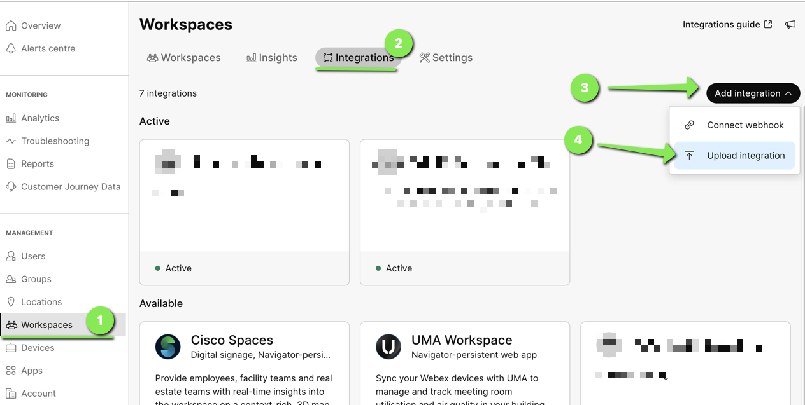

# Workspace Metrics Exporter

This example Python script shows how to export historical workspace metrics from all Workspaces on a Webex Org. 


## Overview

This script leverages a Webex Workspace Integration and its Access Token to query all Workspaces in your Webex Org using list Workspaces Webex REST API.

https://developer.webex.com/docs/api/v1/workspaces/list-workspaces

Next, using the obtained Workspaces Id the script will then query each workspaces historical metrics using the Workspace Metrics API.

https://developer.webex.com/docs/api/v1/workspace-metrics/workspace-metrics

Lastly, once all Workspace Metrics have been collected, the script saves the exported data as single CSV file.


## Setup

### Prerequisites & Dependencies: 

- Webex Org Admin Access
- Python version >= 3.8
- Pip install modules
- Network Access to reach Webex APIs at domain: ``https://webexapis.com``

<!-- GETTING STARTED -->

### Workspace Integration Setup:

1. Using the Workspace Integration builder tool, create a new manifest file and give it a name and description:

    https://cisco-ce.github.io/workspace-integrations-editor/

    

2. Give your integration the following access scopes and delete any other auto populated scopes:
    ```
    spark-admin:workspaces_read
    spark-admin:workspace_metrics_read
    ```
    

3. Delete all xAPI scopes as these are not required for this script

    

    

4. Export and save the manifest file:

    

5. On your Webex Org Control Hub. Go to Workspaces -> Integrations and click ``Add Integration`` and then ``Upload Integration``:

    

6. Select the manifest file you created earlier and click upload

    

7. Save a copy of the Client ID and Secret (required for the script) and the click ``Go To Integration``

    

8. On the Workspace Metrics integration page, click ``Actions`` and then click ``Activate``

   

9. Review the permissions and then click ``Activate``

    

10. Save a copy of the JSON Web Token (JWT) (required for the script)

    


### Installation Steps:

1.  Close this repo:
    ```sh
    git clone https://github.com/wxsd-sales/workspace-metrics-exporter.git
    ```
2.  Insert project requirements:
    ```sh
    pip3 install -r requirements.txt
    ```
3. Rename ``.env.example`` to ``.env`` and add your Workspace Integration Client ID, Secret & JSON Web Token (JWT)
    ```
    CLIENT_ID=""
    CLIENT_SECRET=""
    JWT=""
    ```
4. Run the script using:
    ```sh
    python3 workspace.py temperature -f 2024-04-09T19:21:00Z -t 2024-04-10T17:21:00Z
    ```
    Once completed, exports are saved to the exports folder with the filename ``workspace-metrics-datetime.csv``

5. You can use the ``-h`` parameter to list of all supported meteric names and additional parameters to get any metric data for supported time ranges, intervals etc.
    ```sh
    python3 workspace.py -h

    usage: workspace.py [-h] {soundlevel,ambientnoise,temperature,humidity,tvoc,peoplecount,timeused,timebooked} ...

    This Scripts lets you bulk export Workspace Metrics for your Webex Org

    options:
    -h, --help            show this help message and exit

    subcommands:
    The metric name you want to export

    {soundlevel,ambientnoise,temperature,humidity,tvoc,peoplecount,timeused,timebooked}
                        asdf
    soundlevel          Estimated averaged sound level in the workspace
    ambientnoise        Estimated stationary ambient noise level in the workspace (background noise level)
    temperature         Ambient temperature in the workspace
    humidity            Relative humidity in the workspace
    tvoc                (Total Volatile Organic Compounds) - Indoor Air Quality
    peoplecount         Number of detected people in the workspace
    timeused            Duration for which the workspace has been used
    timebooked          Duration for which the workspace has been booked
    ```

6. (Optional) Setup a Cron job ( Linux ), Automator Task ( Mac)  or Scheduled Task ( Windows ) to periodically run this script and export your Workspace metrics on a daily bases
    
    
    
## Demo

Check out our live demo, available [here](https://app.vidcast.io/share/c95e524a-43e4-4ffe-a5c6-d8654ed98da3)!

*For more demos & PoCs like this, check out our [Webex Labs site](https://collabtoolbox.cisco.com/webex-labs).


## License

All contents are licensed under the MIT license. Please see [license](LICENSE) for details.


## Disclaimer
  
 Everything included is for demo and Proof of Concept purposes only. Use of the site is solely at your own risk. This site may contain links to third party content, which we do not warrant, endorse, or assume liability for. These demos are for Cisco Webex use cases, but are not Official Cisco Webex Branded demos.


## Questions
Please contact the WXSD team at [wxsd@external.cisco.com](mailto:wxsd@external.cisco.com?subject=workspace-metrics-exporter) for questions. Or, if you're a Cisco internal employee, reach out to us on the Webex App via our bot (globalexpert@webex.bot). In the "Engagement Type" field, choose the "API/SDK Proof of Concept Integration Development" option to make sure you reach our team. 
